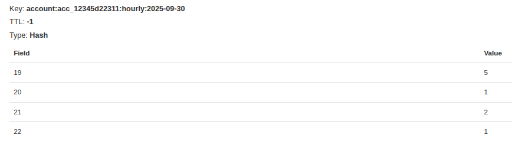
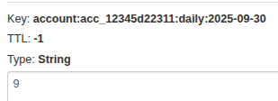
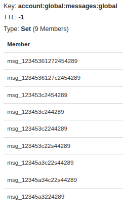

# Decisions.md

## Cómo diseñaste la solución

### Estructura y Arquitectura
La solución se diseñó pensando en ser reutilizable, escalable y fácil de mantener a largo plazo. Se implementó con NestJS y microservicios utilizando **arquitectura hexagonal (puertos y adaptadores)** siguiendo las mejores prácticas de desarrollo.

### Tecnologías Seleccionadas
- **Redis**: Elegido como base de datos principal por su velocidad y simplicidad. Al ser la función principal un proceso de conteo, no se requería una base de datos más completa.
- **Kafka**: Seleccionado como message broker por su estabilidad, alto throughput y capacidad de manejo de offset manual, garantizando que ningún evento se pierda en el trayecto.
- **API Gateway**: Implementado para centralizar y direccionar todas las requests del sistema.

### Modelo de Datos
Los datos se almacenan en Redis siguiendo una convención de nombres jerárquica separada por dos puntos (:), asegurando una base de datos rápida y organizada.

**Topics principales:**

1. **Hourly**: `account:acc_12345:hourly:2025-09-29` (tipo hash)
   - Almacena un hash que registra las horas del día junto con la cantidad de mensajes enviados por cada hora.
   - Ejemplo: `{5: 1, 7: 4, 21: 4}`
   - Redis permite manipular campos individuales sin recuperar todo el hash
   
   

2. **Daily**: `account:acc_12345:daily:2025-09-29` (tipo string)
   - Almacena la cantidad total de mensajes enviados por una cuenta en el día
   - Ejemplo: `"17"`
   
   

3. **Messages**: `account:acc_12345:messages:account:acc_12345d22311:messages:2025-09-30` (tipo SET)
   - Almacena un SET con los messageId para llevar un registro de los mensajes de cada cuenta.
   - Ejemplo: `[msg_1234ASDdF, msg_1234A33SDdF, msg_1234A44455533SDdF]`
   - Garantiza idempotencia al asegurar que cada mensaje se cuente solo una vez
   
   

### Endpoints
Se diseñaron endpoints mínimos y necesarios con validaciones en los campos más relevantes:
- Endpoints REST para comunicación HTTP
- Comunicaciones de microservicios vía Kafka topics/patrones

## Cómo aseguraste idempotencia y consistencia

### Idempotencia
Se solucionó almacenando el `messageId` en Redis usando una clave `account:global:messages:global` con valor tipo SET. Esto garantiza que cada mensaje se procese solo una vez, independientemente de cuántas veces llegue al servicio.

### Consistencia
Para asegurar la consistencia de los datos se implementaron dos estrategias principales:

1. **Kafka como Message Broker**: Funciona como sistema de colas con alto throughput y su sistema de offset asegura la entrega de todos los mensajes.

2. **Offset Manual**: Se desactivó el auto-commit de offset en los microservicios para asegurar que el seguimiento del procesamiento completo sea más preciso, confirmando manualmente en la capa de aplicación.

## Supuestos que tomaste y qué mejorarías con más tiempo

### Supuestos
- Necesidad de manejar un alto volumen de requests
- El `messageId` es único globalmente y no se puede repetir nunca (ni siquiera entre usuarios diferentes)
- Validaciones críticas en endpoints para asegurar integridad de datos

### Mejoras Futuras
- **Manejo centralizado de errores**: Implementar un sistema más organizado y estructurado para el manejo de errores
- **Respuestas de API estandarizadas**: Crear un manejo centralizado para las respuestas, ya que actualmente envía payload completo sin estructura definida
- **Limpiar**: Limpiar comentarios, logs precindibles, etc.

## Si usaste IA, cómo fue que la usaste

### Uso de IA
- **Explicaciones y guías**: Solicité explicaciones para entender las posibles alternativas de implementación y resolver dudas que surgían durante el desarrollo
- **Comparación de tecnologías**: Usé IA para evaluar diferentes opciones de diseño y tecnologías

### Uso de Copilot
- **Desarrollo acelerado**: Utilicé GitHub Copilot para acelerar el desarrollo, pero siempre pidiendo sugerencias muy estructuradas y específicas
- **Tareas puntuales**: Lo usé para necesidades concretas manteniendo control sobre la arquitectura general
